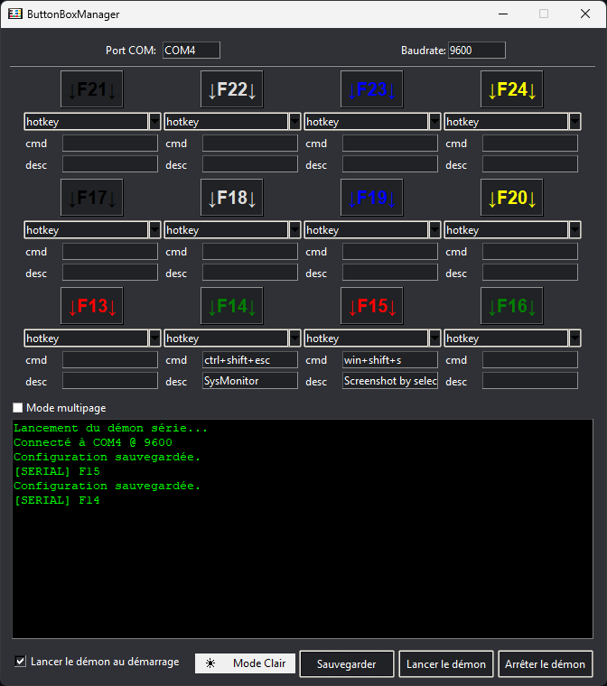

# ButtonBoxManager
DIY button interfacer with arduino nano 

This python script is made to interface 12 buttons that can trigger keyboard shorcuts or custom commands
It use 

Python dependances:
 -
 <pre>pip install pyautogui pyserial</pre>
 <pre>sudo apt install python3-tk</pre>

Here is the hardware:  
 -

Soldering:
 -

Screenshots:
 -
Ether choose between multiple pages or just one page mode

  
  

Flash Arduino:
 -
You need to flash arduino_nano_rom.ino using arduino IDE
 Open arduino ide and select your board, then
 File -> Open -> then open arduino_nano_rom.ino
 

 Clic upload
 

Config file:
 -
You can edit max pages in the config.json 
Rest of config can be done in the gui.

Launch:
 -
 - in powershell, launch
 <pre> python.exe path/to/ButtonBox/ButtonBoxManager.py </pre>

to be added:
 -
- Command line / no head program
- packed to exe
- choose buttons number
- linux compatiblility
- custom png instead of button + desc
- multi language support
- who knows...
